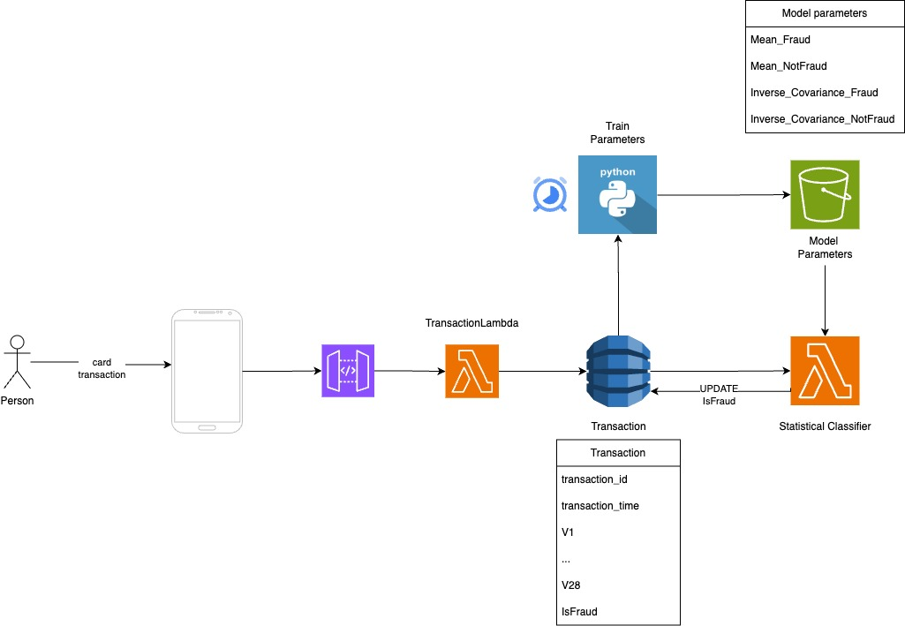

# Credit Card Fraud Detection System

## Problem
Credit card transaction fraud poses a significant threat to the financial industry, jeopardizing the security of both cardholders and financial institutions. This nefarious activity stems from various factors, including stolen card information, identity theft, and the illicit use of cards for unauthorized transactions.

Addressing this pervasive issue necessitates the establishment of a systematic approach for real-time fraud detection. Leveraging machine learning algorithms and mathematical models, financial institutions can develop robust mechanisms to identify potentially fraudulent transactions by discerning patterns and anomalies within transactional data.

Through meticulous analysis of transactional data and the deployment of sophisticated fraud detection algorithms, financial entities can effectively mitigate the risks associated with credit card fraud. Timely identification of fraudulent transactions not only helps avert financial losses but also safeguards cardholders against unauthorized charges, thereby fostering trust and confidence in the integrity of financial transactions.


## Dataset
The dataset, available on [kaggle's credit card fraud detection dataset](https://www.kaggle.com/datasets/nelgiriyewithana/credit-card-fraud-detection-dataset-2023), provides an extensive record of credit card transactions made by European cardholders in the year 2023. Comprising over 550,000 entries, it offers a robust volume of transactional data for analysis. To safeguard the identities of cardholders, the dataset has undergone anonymization, ensuring the protection of sensitive personal information. Transactional attributes, anonymized as V1-V28, along with a binary label indicating the transaction's fraudulent nature (1 for fraudulent, 0 for non-fraudulent), form the core components of this dataset.

Note: Please download the data from the provided source and ensure it is extracted into the designated 'data/' folder.

## Objectives of this repository
The primary objective of this GitHub repository is to develop and deploy a robust credit card transaction fraud detection system using AWS resources. The system is designed to read incoming transaction data through an API Gateway, store it on DynamoDB and classify each transaction as either fraudulent or legitimate by an Lambda function. The repository aims to achieve the following objectives:

* Develop a Scalable Fraud Detection System: Utilizing AWS services such as DynamoDB, Lambda functions, and S3 buckets, the repository aims to build a scalable and efficient fraud detection system capable of handling large volumes of transactional data.

* Real-Time Fraud Detection: The system will be designed to process incoming transactions in real-time, ensuring swift identification and classification of fraudulent activities as they occur.

* Utilize Statistical Modeling Techniques: The classification system will employ statistical modeling techniques to effectively classify incoming transactions. (The statistical model erroneously blocked 1.1% of legitimate transactions, while correctly identifying 90.8% of fraudulent transactions on the test set.)

* Optimize Resource Utilization: Through the use of serverless architecture, the system will optimize resource utilization by dynamically scaling resources based on demand, thereby minimizing operational costs.

* Provide Documentation and Guidelines: The repository will include comprehensive documentation and guidelines to facilitate easy setup, deployment, and customization of the fraud detection system. This will enable users to understand the system architecture and effectively utilize the provided resources.

Overall, the GitHub repository endeavors to provide a reliable and scalable solution for credit card transaction fraud detection, empowering organizations to proactively mitigate risks and protect their financial assets and customers.

## Solution Architecture


## Basic Setup
The following setup is recommended but not mandatory.
### Virtual Environment:
Create and activate a virtual environment
```bash
python -m venv venv
venv\Scripts\activate
```
### Install dependencies from requirements.txt
```bash
pip install -r requirements.txt
```

### Configure AWS CLI
Create a .env file within the 'notebook/' directory, and include your ACCESS_KEY and SECRET_ACCESS_KEY credentials.
```bash
aws configure
```

### Build SAM Template
```bash
sam build --use-container
```

### Deploy SAM Template
```bash
sam deploy --stack-name credit-card-fraud-detection-system --capabilities CAPABILITY_NAMED_IAM --resolve-s3
```
Once the stack has been deployed, make sure to populate the model parameters by running the 'notebooks/train_parameters.ipynb' file.

### Delete SAM Template
```bash
sam delete --stack-name credit-card-fraud-detection-system
```

### Deactivate Virtual Environment
```bash
deactivate
```

# <span style="color:red">! Warning !</span>
Please be advised that the following setup may incur charges from AWS services. While efforts have been made to provide guidance on cost-effective practices, I am not responsible for any AWS charges that may occur as a result of running this code. It is essential to review AWS pricing and monitor usage to avoid unexpected expenses.

You are solely responsible for managing and monitoring any potential costs associated with running this code on AWS. I do not guarantee any financial costs incurred by utilizing this setup.

Please exercise caution and prudence when deploying and operating AWS resources to minimize any financial risks.